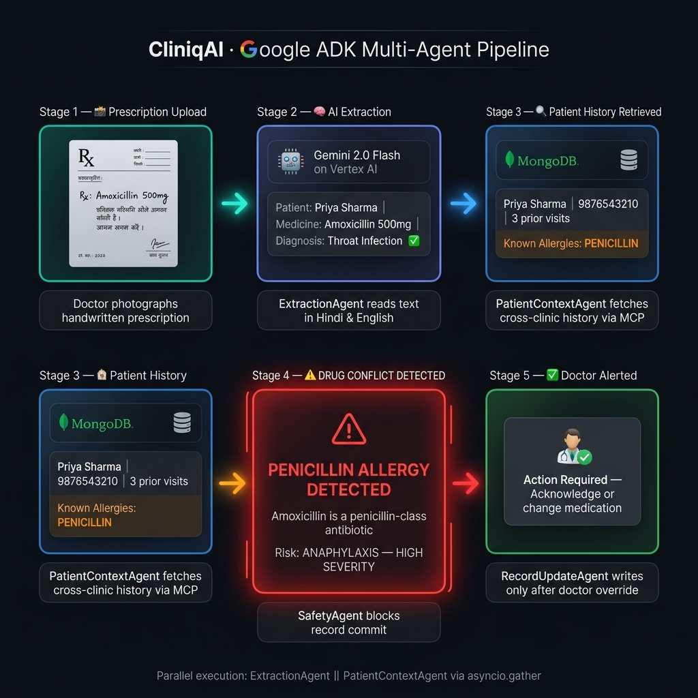
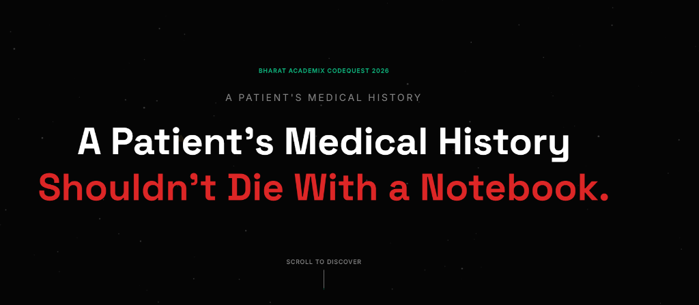
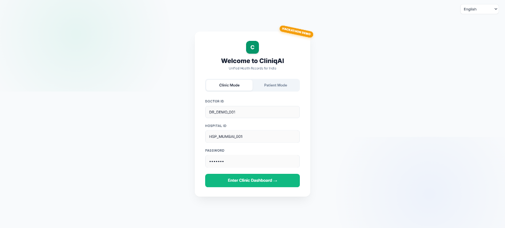
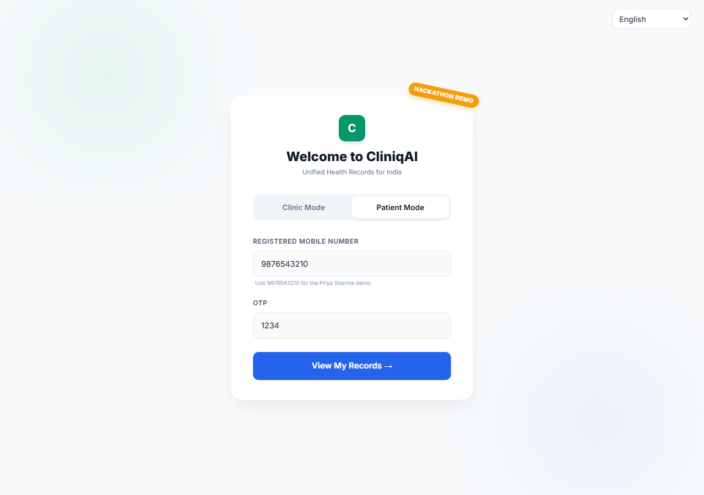
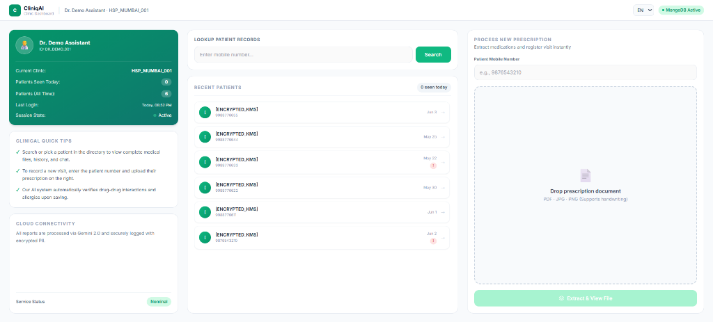
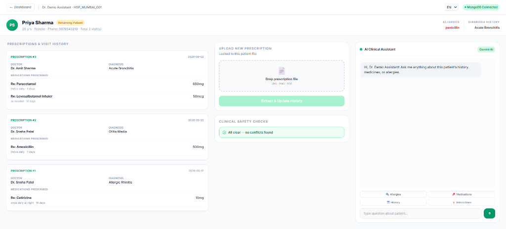
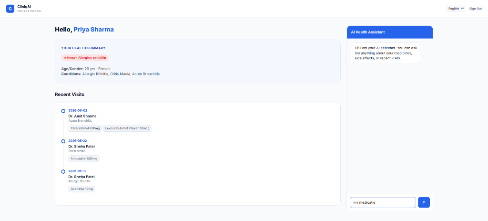

<div align="center">

# 🏥 CliniqAI
### *The AI Safety Bridge for India's 1.3 Million Clinics*
### *Multi-Agent Clinical Workflow — Built on Google ADK*

[](https://cliniqai-1072937704425.asia-south1.run.app)
[](https://google.github.io/adk-docs/)
[](https://cloud.google.com/vertex-ai)
[](https://www.mongodb.com/atlas)

**👉 [TRY IT LIVE RIGHT NOW](https://cliniqai-1072937704425.asia-south1.run.app) 👈**
> *Demo credentials pre-filled. Just click Login.*

</div>

---

## 🚨 The Tragedy — A 100% Preventable Crisis

Priya, a 42-year-old mother of two from rural Maharashtra, manages her diabetes carefully. Three years ago, at a clinic 30km away in Nagpur, she was diagnosed with a severe Penicillin allergy. That critical, life-saving piece of information was dutifully recorded—**in a single paper register that never left the clinic.**

On March 5, 2026, Priya visits her local village clinic with a persistent chest cold. Dr. Patel, an overworked doctor seeing 80+ patients a day, writes a prescription for Amoxicillin—a Penicillin-class antibiotic. 

Dr. Patel is a good doctor. But he has absolutely no way to know he is prescribing a drug that could kill her. The data exists, but it is invisible.

Within an hour of taking the medicine, Priya goes into anaphylactic shock. She survives after an agonizing week in the ICU, but suffers permanent kidney damage. Her family is left with ₹3,50,000 in medical debt—more than two years of her husband's income. Their eldest daughter drops out of school to work.

**This exact tragedy happens thousands of times daily across India, resulting in 5.6 million preventable hospitalizations per year.**

---

## 💡 The Solution — Enter CliniqAI

Big hospitals buy ₹37 Lakh/year enterprise EHR systems like Epic and Cerner. 
The remaining **1.3 million small clinics in India (95% of all healthcare)** are left with paper registers or chaotic WhatsApp groups.

CliniqAI is a 100% free, mobile-first, multi-agent AI platform that brings enterprise-grade clinical safety to the most remote clinics in the country. It takes **under 3 seconds** to save a life.

1. **📸 Capture:** The doctor snaps a photo of a handwritten prescription on their phone.
2. **🧠 Extract:** Gemini 3.5 Flash (via Vertex AI) instantly extracts medicines and dosages from the handwritten text in 6 Indian languages.
3. **🔍 Context:** The AI instantly fetches the patient's entire cross-clinic medical history using their mobile number as the universal ID via MongoDB MCP.
4. **🛡️ Protect:** A strict, algorithmic Safety Agent cross-references the new drugs against the patient's known allergies and the WHO Essential Medicines List. 
5. **⚠️ Alert:** If there is a severe interaction, the system throws a **HARD BLOCKING GATE**, preventing the prescription from being logged until the doctor overrides it.

---

## ⚡ How It Works — In One Image

> **The entire multi-agent pipeline, in a single glance.** From a handwritten Hindi prescription to a blocking drug-allergy alert — all automated, all traceable.



---

## 🏗️ Deep Dive: The Technology Stack

Every technology in CliniqAI was chosen to solve specific clinical challenges in rural India.

### 1. Google Gemini 3.5 Flash (via Vertex AI)
Legacy OCR models (like Tesseract) fail completely on Indian doctor handwriting. Gemini 3.5 Flash ingests the image directly using its native multimodal capabilities, accurately parsing prescriptions in **English, Hindi, Bengali, Telugu, Marathi, and Tamil**. Crucially, it understands medical context (e.g., parsing "BD" as "Twice Daily").

### 2. Google Agent Development Kit (ADK)
A single monolithic LLM prompt is dangerous for healthcare. We built a **Supervisor + 4 Specialized Agents** architecture using the ADK.
- **ExtractionAgent** and **PatientContextAgent** run in *parallel* (`asyncio.gather`) to mask Gemini's OCR latency behind the MongoDB lookup.
- **SafetyAgent** is mapped to an ADK `FunctionTool` holding deterministic WHO data. It provides algorithmic safety gates that cannot be bypassed.

### 3. MongoDB Atlas & MCP (Model Context Protocol)
Medical documents (prescriptions, lab reports, X-rays) have wildly varying structures. Relational SQL breaks here. MongoDB's flexible JSON document structure is perfect. We expose this to our AI agents securely using an **MCP Server**, allowing agents to query the database naturally while respecting strict access controls.

### 4. Cloud KMS & SHA-256 (Data Security & Sovereignty)
Patients **own** their data. CliniqAI ensures it:
- **OTP-Based Access:** A patient's mobile number is their ID. They grant and revoke clinic access via time-limited OTPs.
- **Immutable Audit Trails:** Every DB write creates a SHA-256 hash-chain. Tampering with medical records breaks the chain, ensuring cryptographic integrity.
- **Envelope Encryption:** All Personally Identifiable Information (PII) is encrypted at rest using Google Cloud KMS. Even DB admins cannot read raw patient data.

### 5. Context-Aware AI Chatbot
Doctors don't have time to scroll through 10 years of PDF records. Our platform includes an AI clinical assistant with full context of the patient's MongoDB history. A doctor can simply ask: *"What BP meds is Priya currently on?"* and get an instant, accurate answer—saving 5-10 minutes per consultation.

---

## 🤝 How CliniqAI Supplements ABHA

CliniqAI does **NOT** compete with the Ayushman Bharat Digital Mission (ABDM). We are the active AI safety layer that ABHA currently lacks.

| Feature Area | ABHA (Current System) | CliniqAI (Active Safety Bridge) |
|:---|:---|:---|
| **Core Function** | Stores records passively | **Actively prevents medical errors** |
| **Input Method** | Requires digital/typed input | **OCR for 6 handwritten languages** |
| **Drug Interactions** | None | **WHO EML + OpenFDA alerts** |
| **Onboarding Friction**| Requires ABHA ID creation | **Instant via Mobile Number** |

**The Roadmap Integration:** In Phase 3, CliniqAI will seamlessly migrate from mobile number keys to Aadhaar-linked ABHA IDs. CliniqAI will serve as the AI frontend, actively syncing to the ABHA national registry and accelerating ABDM adoption across rural clinics.

---

## 📱 Application Walkthrough

### 1. The Landing Page — Emotionally Powerful Storytelling
Real statistics, a powerful visual timeline of a preventable medical error, and a clear presentation of how CliniqAI acts as a safety bridge.



### 2. Dual Login — Clinic Mode & Patient Mode
Pre-filled demo credentials for instant testing. No setup friction.

| Clinic Login | Patient Login |
|:---:|:---:|
|  |  |

### 3. Clinic Dashboard — The Doctor's Command Center
Search patients by phone number instantly, view session state, and see unified records activity.



### 4. Patient Clinical File — Total Medical Intelligence
Unified patient clinical file showing prior prescriptions, active visits history, known patient allergies, clinical safety checks, and the AI Clinical Assistant.



### 5. Patient Portal — True Data Sovereignty
Patients can view all their records from all clinics, see the health summary and recent visits timeline, and ask the chatbot questions.



---

## ⚡ Quick Start — Run in 3 Steps

```bash
# 1. Clone the repository
git clone https://github.com/pranjaljha103/Bharat-Academix-Codequest.git
cd Bharat-Academix-Codequest

# 2. Set up environment
cp .env.example .env
# Fill in: GOOGLE_CLOUD_PROJECT, MONGODB_URI, VERTEX_AI_LOCATION

# 3. Run locally
pip install -r requirements.txt
python -m uvicorn cliniqai.agent.server:app --reload
```

**Or experience the magic instantly: [https://cliniqai-1072937704425.asia-south1.run.app](https://cliniqai-1072937704425.asia-south1.run.app)**

---

## 🔮 The Road Ahead

- [x] **Phase 1 (Now):** MVP Launch — 4-agent ADK pipeline, Gemini OCR, MongoDB context memory, strict algorithmic safety gates.
- [ ] **Phase 2 (Q3 2026):** WhatsApp bot for frictionless prescription uploads, Hindi voice-first interface for rural doctors, SMS alerts.
- [ ] **Phase 3 (Q4 2026):** ABHA Sync — Migrate to Aadhaar-linked ABHA IDs. Two-way ABDM health record synchronization.
- [ ] **Phase 4 (2027):** Population Intelligence — Anonymized disease trend detection across regions, predictive epidemic early warnings.

---

<div align="center">

**Built on Google Cloud · Orchestrated with Google ADK · Deployed on Cloud Run**

[](https://google.github.io/adk-docs/)
[](https://cloud.google.com/vertex-ai)
[](https://mongodb.com)

*For 800 million patients who deserve better healthcare.*

</div>
